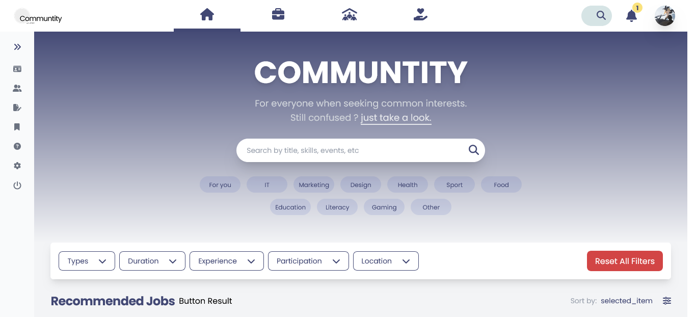
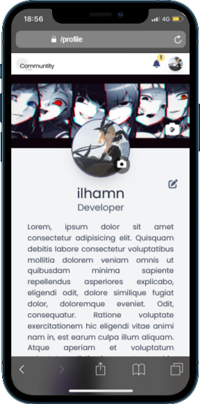

# Hello Folks,

Are you confused about how to get started?, Welcome to communtity, for everyone when seeking common interests.


## Demo

- Desktop
  

- Mobile
  

## Tech Stack

**Client:** Next.js, React.js, Typescript, TailwindCSS.

**Server:** Microservices Architecture

- **Authentication Service:** Node.js, Express, MySQL, Redis (for session and token management)
- **Profile Service:** NestJS, MongoDB
- **Upload-Download Service:** Go, Gin, Cloudinary (file storage)
- **Messaging:** RabbitMQ
- **Containerization** Docker, Docker Compose
- **CI/CD:** Github Actions

## Installation

Install `Communtity` with npm

```bash
  git clone https://github.com/IlhamLamp/communtity.git
  cd communtity
  npm install
  npm run start
```

## Contributing

Contributions are always welcome!
